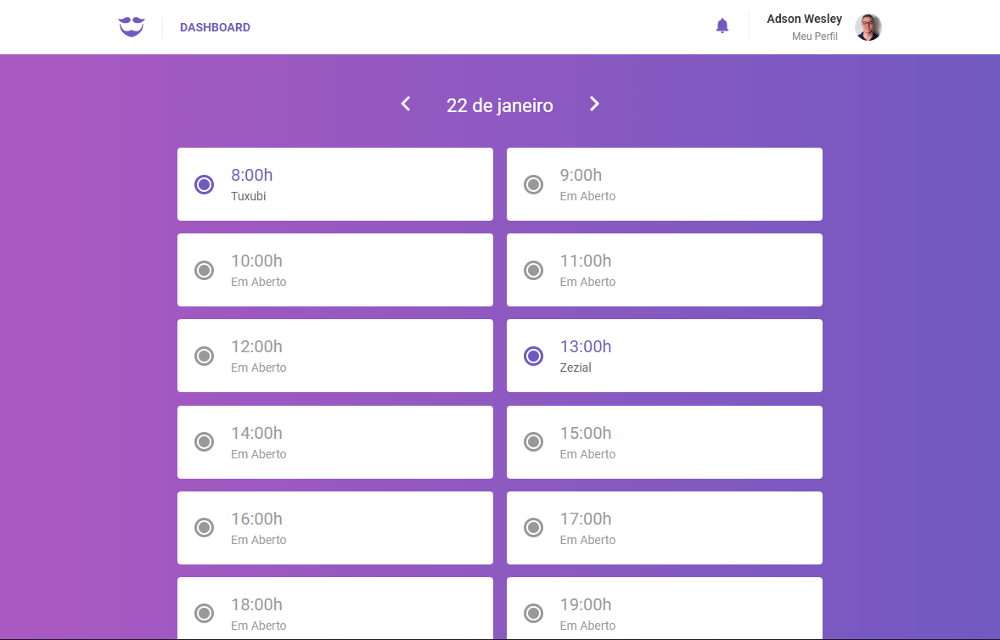
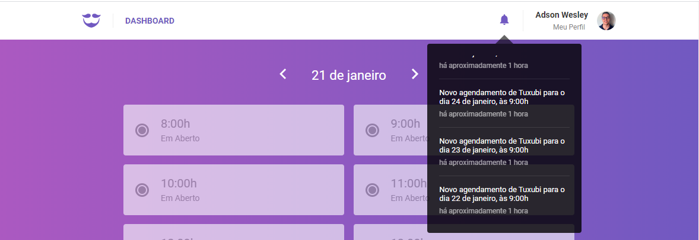
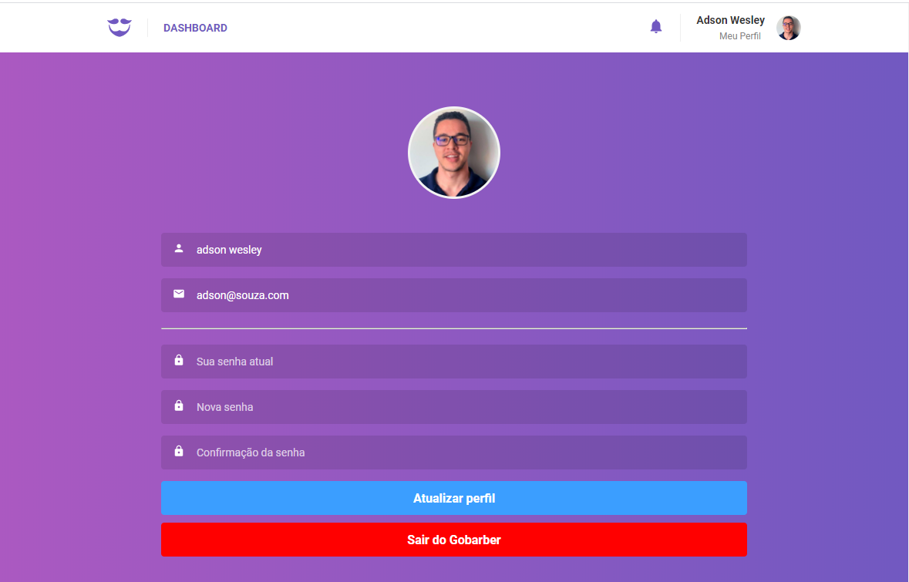

<h4 align="center">
    
     
     
    Go Barber Web
</h4>

Aplicação web para gerenciamento de agendamento de barbearia

### Sobre
  Go barber é uma aplicação de gerenciamento de agendamento de barbearia. Ela é dividida em duas plataformas, web e mobile. A aplicação mobile é usada pelos clientes, onde o cliente pode selecionar o prestador de serviço e data para agendar o serviço. Já a parte web é usada pelo prestador de serviço onde ele pode visualizar quais os agendamentos dos dias da semana. Todas as duas aplicações consomem a mesma API https://github.com/adsonxzx/go-barber.

### Tecnologias Usadas

- React
- Redux
- Redux Saga
- Axios
- History
- Immer
- React Toastify
- React Router Dom
- React Icons
- Styled Components
- Reactotron
- Date Fns
- Eslint
- Prettier

### Dashboard
  No dashboard são listados todos os agendamentos do dia em questão.

### Notificações
  Toda vez que um cliente faz um agendamento, o prestador recebe uma notificação.

### Profile
  O prestador pode atualizar seus dados e sua foto do perfil.

